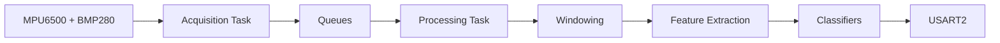

# STM32 Edge ML Inference Node

## Overview

An STM32L476 runs FreeRTOS and acquires motion data from an MPU6500 and temperature and pressure data from a BMP280. On-device classifiers use logistic regression models trained with Python and scikit-learn, then exported as C parameters for motion and environmental classification. This provides deterministic embedded edge inference for condition monitoring, robotics, and IoT systems.

## System



| Component | Role |
| --- | --- |
| NUCLEO-L476RG | MCU and FreeRTOS platform |
| MPU6500 | 100 Hz motion sensing |
| BMP280 | 25 Hz temperature and pressure sensing |
| Breadboard + jumper wires | Sensor connections |
| USB / ST-LINK | Programming, debugging, and serial communication |
| STM32 HAL + FreeRTOS | Hardware access and RTOS services |
| Python + scikit-learn | Model training and evaluation (performed on the host CPU) |

## How It Works

- The acquisition task owns I2C1 and samples both sensors.
- The processing task builds overlapping one-second windows and extracts features.
- The motion model classifies `STATIONARY`, `ROTATION`, `TRANSLATION`, `VIBRATION`, and `IMPACT`.
- The environment model classifies `COLD`, `NORMAL`, and `HOT`.

The model vectors contain 12 motion features and 4 environmental features. The exported environment model currently assigns weight only to mean temperature.

## Repository

```text
.
├── firmware/
│   ├── stm32/                         # STM32CubeMX project and build files
│   │   ├── Core/, Drivers/, Middlewares/ # Generated HAL and FreeRTOS infrastructure
│   │   └── Core/Src/freertos.c        # Project task and queue pipeline
│   ├── drivers/{mpu6500,bmp280}/      # Project sensor drivers
│   ├── processing/windowing.c         # Fixed overlapping windows
│   ├── features/feature_extraction.c  # Production feature calculations
│   ├── inference/                     # C classifiers and exported model parameters
│   └── data/                          # Dataset collection output
├── ml/{data,train.py}                 # Captures, training, evaluation, and C export
├── scripts/                           # Verification and dataset collection
├── tests/                             # Host sensor, feature, window, and inference tests
└── requirements.txt                   # Pinned Python dependencies
```

STM32CubeMX generated the MCU and HAL initialization infrastructure. The application logic, sensor integration, feature extraction, inference, tests, and validation were implemented as project code.

## Run

1. Wire both sensors to I2C1: `PB8` for SCL, `PB9` for SDA, `3V3`, and `GND`. The firmware expects the MPU6500 at `0x68` and BMP280 at `0x76`.
2. Connect the NUCLEO board through its ST-LINK USB port, then verify and build from the repository root:

   ```sh
   ./scripts/verify.sh
   ```

3. Flash the generated Debug image:

   ```sh
   st-flash --reset write firmware/stm32/build/Debug/multisensor-inference-node.bin 0x08000000
   ```

4. Find the ST-LINK serial port and open USART2 at 115200 baud:

   ```sh
   ls /dev/cu.usbmodem*
   picocom --baud 115200 --flow n --parity n --databits 8 --stopbits 1 /dev/cu.usbmodem1103
   ```

   Replace the device path if needed. Linux typically uses `/dev/ttyACM0`.

5. Wait about one second for the first windows, then look at the predictions:

   ```text
   MOTION,91,ROTATION
   ENVIRONMENT,95,NORMAL,86.2F
   STATUS,MPU=OK,BMP=OK,...
   ```

The numeric fields count predictions, the environment line includes mean temperature in Fahrenheit, and `STATUS` reports sensor health and read totals. Below is an example output of the system at a consistent temperature with motion adjustments.


## Results

| Measurement | Result |
| --- | ---: |
| Motion validation accuracy / Macro F1 | 87.22% / 86.14% |
| Motion test accuracy / Macro F1 | 89.29% / 89.23% |
| Environment validation accuracy / Macro F1 | 100.00% / 100.00% |
| Environment test accuracy / Macro F1 | 100.00% / 100.00% |
| Deterministic feature reference checks | 8 of 8 exact |
| Debug image flash / SRAM | 55,800 B / 19,984 B |
| Recorded 30 s hardware validation | PASS, 0 sensor failures, 0 queue drops |

These classification metrics come from datasets caputred across sepeate sessions. They describe the checked-in controlled captures, not accuracy in every installation.

- MPU6500 and BMP280 readiness and failures are tracked independently, so one unavailable sensor does not stop the other processing path.
- Three consecutive read failures trigger sensor reinitialization, and unavailable sensors are retried once per second.

## Development With Codex

Codex was used as a development assistant to automate repetitive dataset collection and validation work, help write and extend tests and documentation, and review or debug changes. This review caught issues including unexpectedly accelerated dataset collection. Generated changes were retained only after review, builds, tests, and validation on the STM32 hardware.
