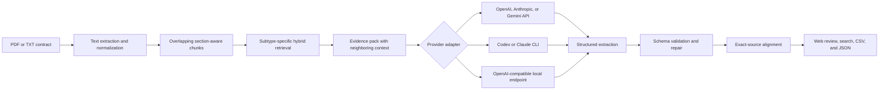

# ContractLens Technical and Evaluation Report

## Executive summary

ContractLens is a provider-agnostic contract analysis application built for the 50-document CUAD take-home subset. It extracts termination, confidentiality, and liability provisions verbatim, creates a 100–150 word contract summary, aligns extracted passages back to the source, and exports CSV and JSON. The same Python pipeline powers the web app and batch CLI.

The strongest evaluated output is the targeted ensemble augmented by complementary `gpt-5.6-luna` hybrid-RAG and focused recovery passes. It found **76 of 115** overlapping CUAD gold spans for **66.09% gold-span recall**, up from **64.35%** for the original targeted result. All 50 summaries meet the required length, all 50 contracts completed, and 95.65% of non-null clauses align to source text at 90 or above.

Recommended submission artifacts:

- [`output/codex-recovery-luna/results.json`](output/codex-recovery-luna/results.json)
- [`output/codex-recovery-luna/results.csv`](output/codex-recovery-luna/results.csv)
- [`output/codex-recovery-luna/evaluation.json`](output/codex-recovery-luna/evaluation.json)

## System design



Long contracts are searched using narrow queries for renewal notice, termination for convenience and cause, post-termination duties, confidentiality restrictions and exceptions, liability caps and carve-outs, damages exclusions, indemnification, and penalties. The default retriever combines BM25-style scoring, legal phrase patterns, and neighboring chunks. Optional local sentence embeddings can be enabled with `--semantic-rag` for paraphrase retrieval.

The evaluated Luna run used the default hybrid retriever without the optional embedding dependency. Semantic retrieval is implemented as an opt-in local reranker rather than a required heavyweight installation.

## Provider strategy

Provider selection is runtime configuration rather than application logic. Supported backends are OpenAI, Anthropic, Gemini/Google AI Studio, Codex CLI, Claude CLI, OpenAI-compatible endpoints, and an offline deterministic test adapter.

`gpt-5.6-luna` was explicitly pinned for the final complementary run. It was chosen instead of the larger locally configured Codex default because this task is bounded structured extraction, not open-ended agentic reasoning. The model completed all 50 contracts without a provider failure. Older experimental artifacts record `codex-cli-default` because those runs did not pin the underlying CLI model; the report does not infer a model name for them.

## Evaluation method

The evaluator compares extracted text with CUAD master annotations for six overlapping labels:

- Notice Period To Terminate Renewal
- Termination For Convenience
- Post-Termination Services
- Uncapped Liability
- Cap On Liability
- Liquidated Damages

A prediction counts as a hit when the normalized gold span appears directly in the extracted category or reaches an 85 partial-fuzzy-match score. The benchmark contains 115 positive gold spans across the 50 selected contracts.

This metric is **gold-span recall**, not overall accuracy, precision, or F1. The requested output categories are broader than CUAD's scored sublabels, and CUAD has no general confidentiality label. Consequently, extra correct clauses are not penalized and confidentiality cannot be scored with this benchmark.

## Experiment results

| Run | Approach | Gold hits | Recall | Termination | Liability | Alignment ≥90 |
|---|---|---:|---:|---:|---:|---:|
| Baseline | Broad retrieval and single Codex CLI pass | 67/115 | 58.26% | 61.11% | 55.74% | 93.48% |
| Refined | Expanded retrieval and prompt | 68/115 | 59.13% | 59.26% | 59.02% | 98.55% |
| Targeted | Ensemble plus six subtype-specific extraction fields | 74/115 | 64.35% | 64.81% | 63.93% | 97.83% |
| Luna hybrid RAG | Independent `gpt-5.6-luna` pass | 62/115 | 53.91% | 51.85% | 55.74% | 97.81% |
| Merged | Targeted result plus complementary Luna passages | 75/115 | 65.22% | 66.67% | 63.93% | 96.38% |
| **Focused recovery** | **Merged result plus narrow Luna subtype recovery** | **76/115** | **66.09%** | **68.52%** | **63.93%** | **95.65%** |

The standalone Luna pass should not replace the targeted result: its broad three-field extraction recovered fewer annotated spans. Its value was complementary—merging exact-source passages added one gold hit without rewriting the source text. A subsequent narrow Luna recovery pass added one more termination-for-convenience hit, moving recall from 65.22% to 66.09% while alignment at 90 decreased modestly from 96.38% to 95.65%. The original targeted subtype pass remains the largest improvement, indicating that decomposition and verification matter more than simply selecting a larger model.

### Final per-label recall

| CUAD label | Hits | Positives | Recall |
|---|---:|---:|---:|
| Notice Period To Terminate Renewal | 11 | 14 | 78.57% |
| Termination For Convenience | 16 | 19 | 84.21% |
| Post-Termination Services | 10 | 21 | 47.62% |
| Uncapped Liability | 15 | 21 | 71.43% |
| Cap On Liability | 21 | 37 | 56.76% |
| Liquidated Damages | 3 | 3 | 100.00% |

Post-termination services and liability caps remain the clearest opportunities for improvement. These provisions are frequently distributed across definitions, survival clauses, schedules, and exceptions instead of appearing in a single obvious section.

## Final quality checks

| Check | Result |
|---|---:|
| Contracts completed | 50/50 |
| Provider failures in Luna run | 0 |
| Summaries within 100–150 words | 50/50 |
| Summary range | 120–145 words |
| Non-null clauses with alignment scores | 138 |
| Clauses aligned at 90 or above | 132/138 (95.65%) |
| Mean alignment score | 95.65 |
| Remaining review warnings | 6 |
| Automated tests | 9 passed |

Warnings are retained for human review rather than silently removed. Extracted passages are re-aligned to the original PDF text, and the ensemble merger accepts exact-source wording instead of model-generated paraphrases.

## Reproducing the final runs

Run the independent Luna extraction:

```bash
contractlens run data/cuad/contracts \
  --provider codex-cli \
  --model gpt-5.6-luna \
  --workers 3 \
  --output output/codex-rag
```

Evaluate it:

```bash
contractlens evaluate output/codex-rag/results.json \
  --output output/codex-rag/evaluation.json
```

Merge complementary exact-source passages with the targeted result and evaluate:

```bash
contractlens merge \
  output/codex-targeted/results.json \
  output/codex-rag/results.json \
  --output output/codex-rag-merged

contractlens evaluate output/codex-rag-merged/results.json \
  --output output/codex-rag-merged/evaluation.json
```

Run the focused subtype recovery pass over the merged result:

```bash
contractlens targeted \
  data/cuad/contracts \
  output/codex-rag-merged/results.json \
  --provider codex-cli \
  --model gpt-5.6-luna \
  --workers 3 \
  --output output/codex-recovery-luna

contractlens evaluate output/codex-recovery-luna/results.json \
  --output output/codex-recovery-luna/evaluation.json
```

Enable optional local semantic reranking for a separate controlled experiment:

```bash
python -m pip install -e ".[semantic]"
contractlens run data/cuad/contracts \
  --provider codex-cli \
  --model gpt-5.6-luna \
  --semantic-rag \
  --output output/codex-semantic-rag
```

## Limitations and next steps

- The benchmark measures recall for six CUAD sublabels only; it does not establish legal correctness or production readiness.
- Confidentiality extraction requires a separate manually labeled validation set.
- Model-reported confidence has not been calibrated.
- Image-only contracts require OCR before extraction.
- A held-out set with human-reviewed false positives is required to report precision and F1.
- The next accuracy experiment should exhaustively map each chunk to subtype candidates, verify candidates independently, and give extra context to post-termination and liability-cap passages.

ContractLens is an information-extraction demonstration, not legal advice. Contracts sent to hosted APIs or authenticated CLIs may leave the local machine; sensitive documents should use an approved local endpoint.
