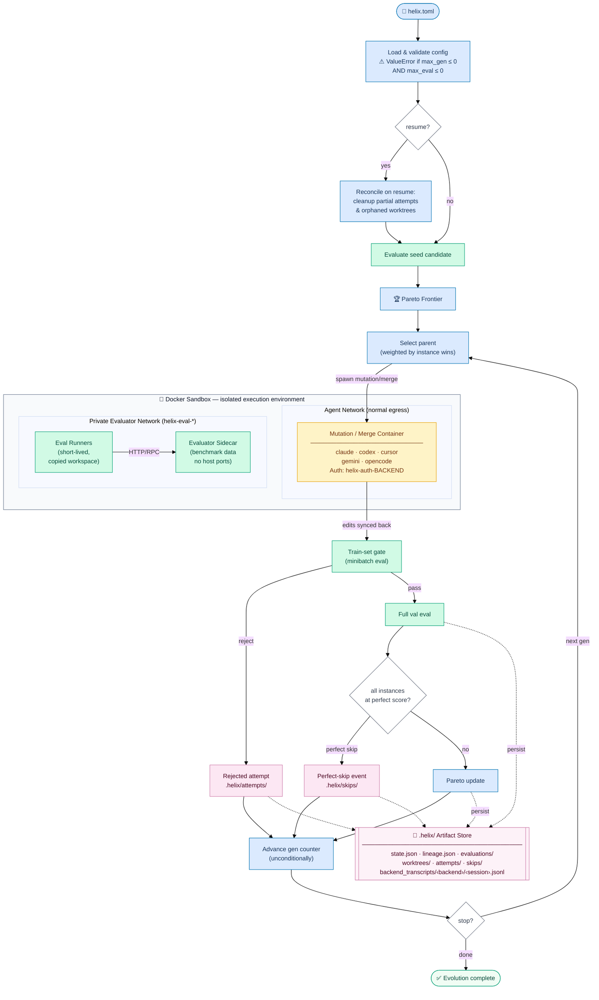

<div align="center">

# 🧬 HELIX

### Hierarchical Evolution via LLM-Informed eXploration

*DNA evolves. So does your codebase.*

[](LICENSE) [](https://www.python.org/downloads/) [](https://pypi.org/project/helix-evo/) [](https://github.com/KE7/helix/actions/workflows/ci.yml) [](https://mypy.readthedocs.io/)

<br>

**Evolutionary optimization for full codebases using agentic coding tools as the mutation engine and git worktrees as the population pool.**

HELIX brings reflective Pareto evolution out of the single-artifact setting and into real software projects: entire repositories, multi-turn agentic mutation, tool use, web research, and verification loops, all inside a single evolutionary stage. Supported mutation backends include Claude Code, Codex CLI, Cursor Agent, Gemini CLI, and OpenCode.

<br>

[Quick Start](#-quick-start) · [How It Works](#-how-it-works) · [Configuration](#-configuration) · [CLI Reference](#-cli-reference) · [Results](#-results)

</div>

---

> **Safety:** HELIX never modifies your working branch, HEAD, staging area, or remote. All mutations live in detached worktrees under `.helix/worktrees/` and branches named `helix/*`. If your checkout is dirty, HELIX snapshots the current tracked and untracked changes into the seed worktree while leaving your original checkout untouched. Run `helix clean` to remove saved state and worktrees when you are done.

---

## Why HELIX?

HELIX is built for a setting that today's evolution systems still do not really handle, including systems like KISS and OpenEvolve: improving **real, multi-file codebases** where useful mutations require exploration, iteration, and tooling, not just a single blind rewrite.

Instead of treating one file or one patch as the candidate, HELIX treats the **entire repository** as the evolving organism. Each mutation is a full agentic coding session running inside an isolated git worktree, so a candidate can:

1. **Read across the codebase** to understand architecture and dependencies.
2. **Edit multiple files coherently** in one mutation.
3. **Use tools mid-mutation** like tests, linters, shell commands, and web search.
4. **Take multiple turns to diagnose and self-correct** before the mutation is scored.
5. **Stay inside one evolutionary stage** rather than requiring an outer orchestration loop to get tool use or iteration.

The result is a new kind of evolutionary optimizer: one that preserves the reflective Pareto-evolutionary core while making it practical for whole repositories and realistic software engineering tasks.

### Coding agent as the mutation engine

The difference between HELIX and `/chat/completions`-style evolvers (GEPA, DSPy-Refine, ShinkaEvolve) is that HELIX's mutation is driven by a **coding agent**, not a single LLM call. A GEPA-style mutation is one prompt → one completion → apply the diff. HELIX's mutation is a full agentic session bounded only by `max_turns`:

| | GEPA / chat-completion evolvers | HELIX |
|---|---|---|
| Mutation shape | Single request/response | Multi-step agentic session |
| Working surface | A single prompt / predictor string | The entire repository in a git worktree |
| Mid-mutation introspection | None | Read any file, grep, glob, `find`, follow imports |
| Mid-mutation verification | None | Run the test suite, type-checker, linter; read failures and react |
| External information | None | Fetch the web, hit GitHub API, query package indexes live |
| Self-correction | None per proposal (retries are separate generations) | Inside one mutation: diagnose a test failure, edit another file, re-run, commit only if green |
| Cost accounting | 1 LLM call = 1 proposal | 1 proposal = N turns, gated by `max_turns` + whatever the agent decides is enough |

This is why a full solver module or a shrinkwrap of an ML kernel behave qualitatively differently than a GEPA run on the same task: HELIX's candidate is the program a team of N humans could edit over an afternoon, not a single text blob produced in one shot.

---

## ✨ Key Features

| | Feature | Description |
|---|---|---|
| 🧬 | **Whole-codebase evolution** | The candidate is your repository, not a single file, prompt, or patch |
| 📂 | **Multi-file editing** | Mutate entire directory trees — edit `auth.py:42` and `routes.py:18` in one coherent session |
| 🔁 | **Multi-turn mutations** | A single mutation can inspect, edit, test, revise, and continue before being evaluated |
| 🔧 | **Tool access during mutation** | The configured backend can read, grep, run tests, inspect the codebase, and use the web mid-mutation |
| ✅ | **Self-verification** | Mutations verify themselves by running commands before committing |
| 📊 | **Pareto frontier** | Instance-level Pareto selection across test cases — no single metric bottleneck |
| ⚡ | **Parallel evaluation** | Worktrees are isolated → parallel proposals via `ThreadPoolExecutor` (GEPA parity, bounded by `evolution.max_workers`) |
| 🔀 | **Merge / crossover** | Combine two frontier candidates that excel on different instances |
| 💾 | **State persistence & resume** | Crash-safe — resume from any generation with `helix resume` |
| 🚦 | **Gated mutations** | Train-set gating rejects regressions before Pareto evaluation |
| 📋 | **Semantic mutation log** | Full trajectory with root-cause analysis, changes made, and parent lineage |

---

## 🔄 How It Works



**The loop in detail:**

1. **Seed** — Your starting code is copied into a git worktree and evaluated
2. **Evaluate** — Start the private evaluator sidecar once, then run short-lived evaluator-runner containers that call it and print `HELIX_RESULT`
3. **Select** — Pick a parent from the Pareto frontier (weighted by instance wins)
4. **Mutate** — Spawn the configured agent backend in an isolated Docker workspace. It can edit candidate files and use its backend auth, but it does not join the evaluator network
5. **Gate** — Re-evaluate on the train set. Reject if the mutation caused regressions
6. **Pareto Update** — Evaluate on the val set and update the Pareto frontier
7. **Merge** — Periodically combine two complementary frontier candidates via the configured backend
8. **Cleanup** — Remove dominated worktrees; persist state; repeat

---

## 🚀 Quick Start

### Installation

```bash
# Clone and install
git clone https://github.com/KE7/helix.git
cd helix
pip install -e .

# Verify
helix --help
```

### Initialize a Project

```bash
cd your-project/
helix init
```

This creates a `helix.toml` config file and a `.helix/` directory. Edit `helix.toml` to set your objective and evaluator.

### Recommended: Enable Docker Sandboxing

For a first HELIX run, use Docker sandboxing. It keeps mutation agents in
copied workspaces and requires a private evaluator sidecar, so agents never see
the evaluator source, benchmark data, or evaluator endpoint.

Install and start Docker, then log in to your selected backend inside its
persistent sandbox auth volume:

```bash
helix sandbox login claude      # or codex, cursor, gemini, opencode
helix sandbox status claude
```

Then enable the sandbox and configure the evaluator sidecar in `helix.toml`:

```toml
[evaluator]
command = "python /runner/evaluate_client.py"
score_parser = "helix_result"

[evaluator.sidecar]
image = "my-private-evaluator:latest"
runner_image = "my-evaluator-runner:latest"
command = "python -m benchmark_server"
endpoint = "http://helix-evaluator:8080/evaluate"
startup_timeout_seconds = 120

[sandbox]
enabled = true
network = "bridge"
skip_special_files = true
```

HELIX keeps this setting opt-in so existing local workflows and machines without
Docker continue to work, but sandboxing is the recommended mode for new projects.

### Connect The HELIX Agent Skill

This repository ships an agent skill at `skills/helix/` with detailed guidance
for writing `helix.toml`, running and debugging HELIX, and migrating GEPA
`optimize_anything.py` workflows.

For Codex, install it into your local Codex skills directory:

```bash
mkdir -p "${CODEX_HOME:-$HOME/.codex}/skills"
ln -sfn "$(pwd)/skills/helix" "${CODEX_HOME:-$HOME/.codex}/skills/helix"
```

Then ask Codex:

```text
Use $helix to set up this project.
```

For Claude Code, this repo includes `.claude/commands/helix.md`, so inside this
checkout you can run:

```text
/helix set up Docker-sandboxed HELIX for this benchmark
```

To use the command from another project, copy or symlink both
`skills/helix/` and `.claude/commands/helix.md` into that project, preserving
the same relative paths.

### Whole-repo-as-candidate Model

HELIX treats your **entire working tree** as the candidate. There is no `target_file` — the configured backend may read, edit, create, or delete any file in the project tree during each mutation. A minimal project layout looks like:

```
my-project/
├── helix.toml       # HELIX config (run `helix init` to generate)
├── evaluate.py      # Your evaluator script (must output JSON with a "score" key)
├── solve.py         # File(s) you want to evolve (the backend will find them)
└── ...              # Any other files; HELIX will consider them too
```

To restrict what the backend touches, set `agent.background` in `helix.toml`:

```toml
[agent]
backend = "claude"
# model = "sonnet"  # optional backend-specific model
background = "Only modify files under src/. Do not edit tests/ or config/."
```

### Run Evolution

```bash
helix evolve
```

### View Results

```bash
# Show the Pareto frontier
helix frontier

# Show the best candidate
helix best

# Export best candidate to a directory
helix best --export ./best-solution

# View full mutation log
helix log
```

---

## ⚙️ Configuration

HELIX is configured via `helix.toml` in your project root.

### Minimal Example

```toml
objective = "Maximize test pass rate and code coverage"

[evaluator]
command = "pytest --tb=short -q"
```

When your evaluator needs project dependencies, make `evaluator.command` use the
same environment those dependencies are installed in. Good patterns are
`uv run python evaluate.py` or a wrapper like `bash run_eval.sh`. Avoid bare
`python3 evaluate.py` unless that interpreter already has everything your
evaluator imports.

### Full Example

```toml
# What you want the code to do better
objective = "Maximize sum of radii of 26 non-overlapping circles packed in a unit square"

# Starting directory (default: current directory)
seed = "."

# RNG seed for deterministic parent selection (default: 0)
rng_seed = 0

[env]
# Fixed non-secret env values injected into evaluator and agent subprocesses
# after passthrough_env. Useful for repeatable run-local service endpoints.
# ANTHROPIC_BASE_URL = "https://model-service.example.invalid/v1"
# ANTHROPIC_API_KEY = "dummy"

[evaluator]
command = "uv run python evaluate.py"
# Available parsers: "pytest" | "exitcode" | "json_accuracy" | "json_score" | "helix_result"
# "helix_result" takes a per-example list matching GEPA optimize_anything's
# `tuple[float, SideInfo] | float` union — each entry is either a bare
# score or a [score, side_info] pair, mixed allowed:
#   HELIX_RESULT=[s_0, s_1, ...]                        # all bare
#   HELIX_RESULT=[[s_0, si_0], [s_1, si_1], ...]        # all rich
#   HELIX_RESULT=[s_0, [s_1, si_1], s_2, ...]           # mixed
# Positional to `helix_batch.json`. HELIX zips it into id-keyed
# `instance_scores` and stores the side_info list for the reflection
# prompt. `HELIX_RESULT` is a machine protocol; use `from helix import log`
# for human-readable evaluator notes.
score_parser = "json_score"
include_stdout = true
include_stderr = true
extra_commands = []               # additional commands to run for context
protected_files = ["evaluate.py"] # optional extra files HELIX must keep immutable

[dataset]
# Cardinality of the train / val splits.  Used by HELIX's minibatch
# sampler to generate example ids (stringified indices by default, or
# opaque "group__N" ids when evolution.batch_sampler = "stratified")
# that the evaluator (running in the worktree) filters against its own
# dataset via helix_batch.json — written as an opaque JSON list[str].
# Leave both unset for GEPA O.A. Single-Task Search / HELIX single-task-no-example mode (dataset=None, valset=None).
# train_size = 200
# val_size  = 200

[seedless]
# Seedless mode: generate initial candidate from objective via LLM
enabled = false
# Optional prompt-grounding training dataset (used only in seedless
# seed generation).  Accepts a JSON array file, a JSONL file, or a
# directory of JSON files.  When provided, the first 3 examples are
# included in the seed-generation prompt for representative grounding.
# train_path = "puzzles/train"
# val_path   = "puzzles/val"

[evolution]
max_generations = 20
perfect_score_threshold = 1.0    # skip proposals whose instance_scores all reach this
max_evaluations = -1             # evaluation budget cap (-1 = no cap)
                                 # NOTE: at least one stopping condition is required —
                                 # max_generations must be > 0 or max_evaluations must be > 0;
                                 # setting both to ≤ 0 raises ValueError at evolution start.
merge_enabled = false            # enable merge/crossover operations
max_merge_invocations = 5        # total merge cap across entire run
merge_val_overlap_floor = 5      # minimum val-set overlap for merge candidates
merge_subsample_size = 5         # stratified val subsample size for merge acceptance (GEPA parity)
max_workers = 8                  # thread-pool cap for parent-eval + mutation pools
                                 # (default: os.cpu_count(), or 32 if that returns None)
num_parallel_proposals = 1       # parallel mutations per generation; "auto" resolves to max_workers // minibatch_size
minibatch_size = 3               # train-set minibatch size for reflective mutation
cache_evaluation = true          # reuse per-instance evaluator results
acceptance_criterion = "strict_improvement"
val_stage_size = 0               # optional first-N val gate before full val
frontier_type = "hybrid"         # Pareto dimensionality (GEPA FrontierType parity):
                                 # "instance" | "objective" | "hybrid" | "cartesian".
                                 # Default "hybrid" matches GEPA optimize_anything.
                                 # Non-instance axes require score_parser="helix_result"
                                 # emitting per-example side_info["scores"] dicts.

[agent]
backend = "claude"               # "claude" | "codex" | "cursor" | "gemini" | "opencode"
# model = "sonnet"               # optional backend-specific model name
effort = "medium"                # optional: "low" | "medium" | "high" | "xhigh" | "max"
max_turns = 20
# background = "Only modify files under src/. Do not touch tests/ or config/."

[sandbox]
enabled = false                  # true = run agent/evaluator subprocesses in Docker
# image = "ghcr.io/ke7/helix-evo-runner-claude:latest"  # optional; defaults from agent.backend
network = "bridge"               # "bridge" | "none" | "host"
skip_special_files = true        # skip FIFOs/sockets/devices during workspace sync
# Agent containers mount a persistent Docker auth volume named
# helix-auth-<backend>. Run `helix sandbox login <backend>` once per backend.

[worktree]
base_dir = ".helix/worktrees"
```

### Docker Sandboxing

When `[sandbox].enabled = true`, HELIX starts `[evaluator.sidecar]` once per
`helix evolve` on a private internal Docker network. Agent containers run in
copied workspaces on the normal agent network and cannot reach that sidecar.
Evaluator-runner containers run only during evaluation, join the private
network, call the sidecar, print evaluator output, and exit.
The long-lived sidecar does not mount the candidate workspace; the runner must
stream the needed candidate files/data over RPC, or execute candidate code
itself and call the sidecar only for private judging/simulation.
`[evaluator.sidecar].image` is the private service image; `runner_image` is the
short-lived client image used for `[evaluator].command`. Keep private benchmark
data in the service image, not in the runner image.

Agent changes are synced back to the real candidate worktree after the backend
exits; evaluator-runner file changes are discarded. HELIX never mounts the host
project root, parent directories, or home directory by default.
`helix.toml`, `.env`, `.env.*`, `.git`, and HELIX runtime artifacts are also
excluded from sandbox workspace copies/sync-back so agents cannot read sidecar
configuration or mutate run settings.
During copy and sync, HELIX skips unsupported special files such as FIFOs,
sockets, and device nodes by default. Set `skip_special_files = false` only if
you want unsupported workspace file types to raise instead of being ignored.

Agent containers mount a persistent Docker auth volume at `/home/node`;
evaluator sidecar and runner containers never receive it. Run
`helix sandbox login <backend>` once per backend to complete that CLI's normal
login flow inside the same Linux container environment HELIX will use later:

```bash
helix sandbox login claude
helix sandbox status claude
```

For Claude, HELIX uses `claude setup-token` for sandbox login because that is
the flow that works cleanly in browserless Docker/SSH-style environments; it
prints a URL and then accepts the code from the browser in the terminal.
Codex similarly uses `codex login --device-auth` so the callback does not depend
on a localhost server inside the container. Gemini starts its normal
interactive CLI with `--skip-trust` so its authentication picker is not blocked
by the temporary sandbox workspace trust prompt. OpenCode starts the normal TUI
so you can choose the provider/model and complete provider login in one setup
session.

The volume names are `helix-auth-claude`, `helix-auth-codex`,
`helix-auth-cursor`, `helix-auth-gemini`, and `helix-auth-opencode`.
This avoids copying host credential stores into Docker. On macOS, Claude/Cursor
browser-login tokens may live in Keychain; on Linux they may live in
Secret Service/libsecret, GNOME Keyring, KWallet, or another desktop keyring.
Those stores are session- and OS-specific, so copying their databases into a
Linux Docker image is not a reliable authentication mechanism. If your
evaluator uses a local proxy, keep that endpoint in your evaluator code as
usual. Docker Desktop supports `host.docker.internal`; Linux users can set
`add_host_gateway = true`.

By default HELIX chooses a published backend-specific mutator image from
`agent.backend`: `ghcr.io/ke7/helix-evo-runner-claude`,
`ghcr.io/ke7/helix-evo-runner-codex`,
`ghcr.io/ke7/helix-evo-runner-cursor`,
`ghcr.io/ke7/helix-evo-runner-gemini`, or
`ghcr.io/ke7/helix-evo-runner-opencode`. To build locally instead, build the
shared base first with
`docker build -t helix-runner-base:latest -f docker/base.Dockerfile .`, then
build the backend image you need, for example
`docker build -t helix-runner-codex:latest -f docker/codex.Dockerfile .`, and
set `[sandbox].image` to that local tag.

Evaluator sidecar images are benchmark-specific and are not published by HELIX.
Use `ghcr.io/ke7/helix-evo-runner-base` or `docker/base.Dockerfile` as a base
for your own `runner_image`; build/publish the private sidecar service image
from your evaluator repository.

### Dataset Modes

HELIX splits dataset concerns across two TOML sections:

| Section | Purpose |
|---|---|
| `[dataset]` | Cardinality only — `train_size` / `val_size` — drives the minibatch sampler when the evaluator owns the dataset and HELIX hands off example ids via `helix_batch.json` (Architecture A). |
| `[seedless]` | Seedless-mode toggle + optional prompt-grounding paths (`train_path` / `val_path`) — used only during seed generation to show the LLM representative inputs. |

| Mode | Config | Description |
|---|---|---|
| **Single-task / no-example** | neither set | GEPA O.A. Single-Task Search (`dataset=None`, `valset=None`): evaluator runs without example-id handoff; uncached eval calls count as 1 metric call. |
| **Example-id handoff** | `dataset.train_size` / `dataset.val_size` set | HELIX samples example ids — stringified indices into `range(train_size)` by default, or opaque task-prefixed ids like `"group_alpha__case_3"` under `evolution.batch_sampler = "stratified"`; the evaluator reads them from `helix_batch.json` (a JSON `list[str]`) in cwd and filters its own dataset. |
| **Seedless multi-task** | `seedless.enabled = true`, `seedless.train_path` set | Seed generation prompt includes the first 3 training examples for grounding. |

HELIX does not own separate dataset files for train/val; your evaluator remains
the source of truth. During evolution HELIX sets `HELIX_SPLIT` (`train` or `val`)
so evaluator-owned datasets can switch behavior by phase, mirroring GEPA's
`trainset` / `valset` duality.

When `evolution.val_stage_size` is set to a positive value and `dataset.val_size` is also set, accepted mutation proposals run a deterministic first-N validation stage before the full validation sweep. Stage-only results are never added to the frontier; HELIX still persists only full-val results for Pareto ranking and resume stability.

### Evaluator Integrity

For non-sandboxed local prototypes, HELIX can lock evaluator-critical files so
mutations and merges cannot game the score by editing the benchmark itself.
Sandboxed runs should use `[evaluator.sidecar]` instead of repo-local evaluator
files.

```toml
[evaluator]
command = "uv run python evaluate.py"
score_parser = "json_accuracy"
protected_files = [
  "evaluate.py",
  "goldens.json",
  "helpers/evaluator_utils.py",
]
```

At run start, HELIX hashes the evaluator command target plus any
`evaluator.protected_files` entries and writes the manifest to
`.helix/evaluator_manifest.json`. Candidates that modify any protected file are
rejected before evaluation.

### Per-example Parallelism Inside the Evaluator

HELIX parallelises across proposals (`num_parallel_proposals`) and across
worktrees, but each evaluator invocation sees one candidate and a batch of
instance ids as a single subprocess. Per-example parallelism — evaluating
multiple ids of one candidate concurrently — lives **inside the evaluator**,
not inside HELIX's engine.

This is a deliberate architectural split: GEPA's reference adapter fans out
per-example in-process, which is essentially free; HELIX's subprocess model
would pay full subprocess-startup cost for each example. If you want N-way
parallelism per batch, your `evaluate.py` should do it directly:

```python
from concurrent.futures import ThreadPoolExecutor

instance_ids = load_batch_from_helix()   # or argv / HELIX_SPLIT path
with ThreadPoolExecutor(max_workers=4) as pool:
    results = dict(zip(instance_ids, pool.map(evaluate_one, instance_ids)))
print(json.dumps({"accuracy": mean(results.values()), "instance_scores": results}))
```

Pick the worker count however you like (constant, CLI arg, derived from
`os.cpu_count()`). HELIX remains agnostic — it just consumes the per-instance
scores the evaluator returns.

### Score Parsers

HELIX includes 4 built-in score parsers to extract metrics from evaluator output:

| Parser | Input | Output | Use Case |
|---|---|---|---|
| **pytest** | Parses `pytest -q` stdout | `scores`: `pass_rate`, `duration`<br>`instance_scores`: per-test pass/fail | Unit test suites |
| **exitcode** | Exit code only | `scores`: `success` (1.0 or 0.0) | Simple pass/fail evaluators |
| **json_accuracy** | JSON stdout with `accuracy` field | `scores`: `accuracy`<br>`instance_scores`: per-instance scores | Classification and benchmark tasks |
| **json_score** | JSON stdout with `score` field | `scores`: `score`<br>`instance_scores`: `score` | Optimization tasks (e.g., circle packing) |

**Example evaluator outputs:**

```python
# json_score parser expects:
print(json.dumps({"score": 2.63}))

# json_accuracy parser expects:
print(json.dumps({
    "accuracy": 0.85,
    "instance_scores": {"puzzle_001": 1.0, "puzzle_002": 0.0}
}))
```

For GEPA-style reflective feedback, prefer structured per-example
`side_info` when using `score_parser = "helix_result"`. For additional
human-readable notes that are not tied to one example, evaluators may call
`from helix import log` and then `log("what happened", key=value)`. HELIX
captures these notes through `HELIX_ASI_LOG`, not stdout, and renders them as
Evaluator Notes in mutation prompts.

Raw `HELIX_RESULT=...` JSON is only consumed by HELIX as a machine protocol and
is not shown to mutators. Evaluator stdout/stderr remain stored for debugging,
but successful mutation prompts omit them when structured diagnostics or
`helix.log()` notes are available; failed evaluations still include stdout and
stderr as fallback debug context.

---

## 📖 CLI Reference

| Command | Description |
|---|---|
| `helix init` | Initialize HELIX in the current directory — creates `helix.toml` and `.helix/` |
| `helix sandbox login BACKEND` | Log into an agent backend inside its persistent Docker auth volume |
| `helix sandbox status [BACKEND]` | Show sandbox login status for one backend or all supported backends |
| `helix sandbox logout BACKEND` | Log out a backend from its persistent Docker auth volume |
| `helix evolve` | Run the evolutionary loop |
| `helix frontier` | Display the current Pareto frontier as a table |
| `helix best` | Show the best candidate; `--export PATH` to copy it out |
| `helix history` | Show the candidate lineage as a tree |
| `helix resume` | Resume a previously interrupted evolution run |
| `helix clean` | Remove all worktrees and `.helix/` state (with confirmation) |
| `helix log` | Show semantic mutation log — full trajectory with parent lineage |
| `helix attempts` | Surface rejected attempt records and perfect-skip events from `.helix/attempts/` and `.helix/skips/` |

### `helix evolve` Options

```
--dir PATH          Project directory containing helix.toml (default: .)
--config PATH       Path to config file (default: helix.toml)
--objective TEXT     Override the objective string
--evaluator TEXT     Override the evaluator command
--generations INT   Override max_generations
--no-merge          Disable merge operations
--backend BACKEND   Override the mutation backend [claude|codex|cursor|gemini|opencode]
--model TEXT        Override the backend model (backend-specific naming)
--effort LEVEL      Reasoning effort: low | medium | high | xhigh | max
```

---

## 🧪 Results

### 🔵 Circle Packing

Pack 26 non-overlapping circles in a unit square, maximizing sum of radii.

| | Score | Config |
|---|:---:|---|
| Seed (naive concentric grid) | 0.9798 | — |
| **HELIX best (gen 14 of 30)** | **2.6360** | `haiku` · `low` effort · `max_turns=20` |
| GEPA optimize_anything ([blog](https://gepa-ai.github.io/gepa/blog/2026/02/18/introducing-optimize-anything/)) | 2.635 | gemini-3-flash |

> **Note:** HELIX **beat the GEPA blog benchmark** (2.6360 vs 2.635) using Claude Haiku with low reasoning effort and a 20-turn per mutation budget. See [`examples/circle_packing/`](examples/circle_packing/) for the full fixture including `solve_optimized.py` (the best evolved solution).

---

## 🏗️ Architecture

```
.helix/
├── config.toml          # Snapshot of helix.toml at run start
├── evaluator_manifest.json # Protected evaluator file hashes
├── state.json           # Generation, frontier, budget
├── lineage.json         # Full ancestry graph
├── log/                 # Semantic mutation logs
│   ├── g1-m0.json
│   └── g2-x0.json
├── worktrees/
│   ├── g0-s0/           # Seed
│   ├── g1-m1/           # Gen 1 Mutation 1
│   └── g2-x1/           # Gen 2 Merge 1
├── evaluations/
│   └── g0-s0.json       # EvalResult per candidate
├── attempts/            # Per-rejected-candidate attempt records (JSON)
└── skips/               # Per-generation perfect-skip event lists (JSON)
```

### Module Overview

| Module | Role |
|---|---|
| `cli.py` | Click CLI — init, evolve, frontier, best, history, resume, clean, log, attempts |
| `config.py` | TOML config parsing via Pydantic v2 |
| `evolution.py` | Main generation loop with gating, merge, and termination on `max_generations` / `max_evaluations` |
| `population.py` | `Candidate`, `EvalResult`, `ParetoFrontier` |
| `worktree.py` | Git worktree lifecycle (create, clone, snapshot, remove) |
| `executor.py` | Run evaluator commands |
| `evaluator_manifest.py` | SHA-256 manifest for protected evaluator files; refresh helpers for mutation and merge candidates |
| `mutator.py` | Backend mutation invocation with autonomous system prompt and HELIX usage artifacts |
| `merger.py` | Backend merge/crossover between complementary candidates |
| `lineage.py` | Ancestry graph tracking |
| `state.py` | Atomic state persistence and resume |
| `display.py` | Rich terminal UI with phase tracking |

---

## 📚 Citation

```bibtex
@software{helix2026,
  title={HELIX: Hierarchical Evolution via LLM-Informed eXploration},
  author={Elmaaroufi, Karim and OMAR},
  year={2026},
  url={https://github.com/KE7/helix}
}
```

---

## 📄 License

BSD 3-Clause License. See [LICENSE](LICENSE) for details.

---

## 🙏 Acknowledgments

HELIX's core evolutionary algorithm is based on **GEPA optimize_anything** by Agrawal, Lee, Ma, Elmaaroufi, Tan, Seshia, Sen, Klein, Stoica, Gonzalez, Khattab, Dimakis, and Zaharia. Their work on applying reflective Pareto evolution to any text made HELIX possible — we extended their algorithm to full codebases and agentic mutation but the foundation is theirs.

- **[GEPA optimize_anything](https://gepa-ai.github.io/gepa/blog/2026/02/18/introducing-optimize-anything/)** — The algorithmic foundation: minibatch-gated Pareto evolution with reflective LLM mutation
- **[Claude Code](https://docs.anthropic.com/en/docs/claude-code)** — Supported HELIX mutation backend
- **[Codex CLI](https://developers.openai.com/codex/cli)** — Supported HELIX mutation backend
- **[Cursor CLI](https://cursor.com/cli/)** — Supported HELIX mutation backend
- **[Gemini CLI](https://github.com/google-gemini/gemini-cli)** — Supported HELIX mutation backend
- **[OpenCode](https://opencode.ai/docs/cli/)** — Supported HELIX mutation backend
- **[OMAR](http://omar.tech/)** — The multi-agent orchestration system used to build HELIX

```bibtex
@article{gepa_optimize_anything2026,
  title={Introducing optimize\_anything},
  author={Agrawal, Lakshya A and Lee, Donghyun and Ma, Wenjie and Elmaaroufi, Karim and Tan, Shangyin and Seshia, Sanjit A. and Sen, Koushik and Klein, Dan and Stoica, Ion and Gonzalez, Joseph E. and Khattab, Omar and Dimakis, Alexandros G. and Zaharia, Matei},
  year={2026},
  url={https://gepa-ai.github.io/gepa/blog/2026/02/18/introducing-optimize-anything/}
}
```

---

<div align="center">
<sub>Built with 🧬 by evolution, for evolution.</sub>
</div>
