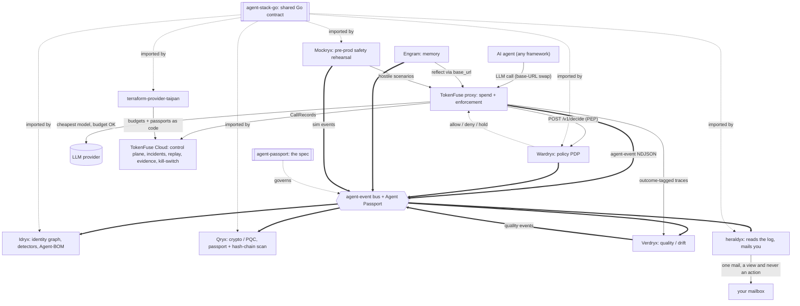

<div align="center">

# Engram: Cognitive Memory Layer for AI Agents

**The SQLite of agent memory: embeddable, local-first, cognitively grounded.**

[](https://github.com/TAIPANBOX/engram/actions/workflows/ci.yml)


</div>

Engram gives an AI agent a persistent, provenance-tracked memory: raw episodic
observations, bitemporal semantic facts that know when they were true, and an
entity graph for associative recall, all in one embeddable `.engram` file with
no server, no Docker, and no API key required to write a memory.

---

## The problem

Every AI agent starts from zero. Ask it something it answered last week - it has no idea. Show it a document it already processed - it processes it again. Tell it Ivan moved to a new company - it still thinks Ivan works at the old one.

This happens because agents have no persistent memory. When the conversation ends, everything is gone.

The usual fix is to throw a vector database at the problem. Store text, embed it, search by similarity. That helps - but it's not enough. You still can't ask *"what did the agent think in March?"* or *"where did this belief come from?"* or *"show me everything the agent knows about Ivan."* A vector search finds similar text. It doesn't understand time, relationships, or importance.

**Engram is memory done properly.**

---

## What Engram does

Engram gives your agent a persistent memory that works like a file - one `.engram` file on disk, no server required. You `pip install` it and start using it in two lines:

```python
from engram import Engram

with Engram(path="./agent.engram") as mem:
    # Remember something
    mem.observe("Ivan moved from Acme to Globex last week", actors=["Ivan"])

    # Recall it later - even in a completely different session
    for r in mem.recall("where does Ivan work?", k=3):
        print(f"[{r.score:.2f}] {r.episode.content}")
```

No server to start. No API key for the store. No Docker. No configuration file.

Here is what Engram gives you that a plain vector database does not:

**Remembers raw events** - every observation is stored with who was involved, what tags apply, and how important it felt at the time. Search finds the right memories even when the query is phrased differently.

**Understands facts** - a background process (no LLM needed at write time) reads your observations and extracts structured knowledge: *Ivan works at Globex*, *Alice is the CTO*. These facts can be queried directly, updated when things change, and traced back to their source.

**Knows what happened when** - if Ivan changes jobs, the old fact is not deleted. It is closed with an end date. You can ask what the agent believed in March even if the truth has changed since.

**Forgets wisely** - memories that haven't been accessed in a while gradually become less important. Memories that matter (accessed often, emotionally significant) stay sharp. The agent doesn't accumulate noise forever.

**Explains itself** - for any fact, you can ask where it came from: which observation triggered it, which LLM run extracted it, with what confidence.

**Works with multiple agents** - several agents can share a single `.engram` file. Each has its own private observations; extracted facts and the relationship graph are shared between them.

<div align="center">


<sub>The same service as its room on <a href="https://it-rat.com/services/engram.html">it-rat.com</a> draws it, where the diagram sits next to a simulation you can scrub back and forth.</sub>

</div>

---

## Where this fits in the stack

Engram is the memory plane of the TAIPANBOX agent-governance stack: it gives agents persistent, provenance-tracked memory, and its own reflection can route through TokenFuse.



- **Consumes**: agent observations (`observe()`).
- **Produces**: `source: engram` events and `why()` provenance, opt-in via the Agent Passport `agent-event` envelope.
- **Talks to**: **TokenFuse** (reflection's LLM adapter can point `base_url` at TokenFuse); governed by the **agent-passport** `agent://` scope.

The full stack is TokenFuse (spend), Wardryx (policy), Engram (memory), Idryx (access), Qryx (crypto), Verdryx (quality), Mockryx (pre-prod), on the shared Agent Passport + agent-event contract (agent-stack-go / agent-passport), configured via terraform-provider-taipan.

Run the whole open stack locally with one command via [**stack-up**](https://github.com/TAIPANBOX/stack-up); the stack's home on the web is [**it-rat.com**](https://it-rat.com).

## Live infrastructure validation

Before any public launch, Engram's Anthropic adapter was run against a real Claude model on real Linux
infrastructure: three independent runs, zero bugs, zero contradictions, every extracted fact carrying
full `why()` provenance back to the observations it came from.


Full write-up and all numbers: [`VALIDATION.md`](VALIDATION.md).


### Running it on a Kubernetes cluster

The whole stack was deployed as a five-node k3s cluster on Hetzner, AWS and GCP
between 25 and 27 July 2026 (six clusters, all destroyed afterwards). The
manifests, the traps and the evidence are public in
[stack-k8s](https://github.com/TAIPANBOX/stack-k8s). Engram is deliberately **not** a pod. The console speaks to
`engram-mcp` over **stdio**, and a sidecar container cannot be another
container's stdin, so the binary has to live inside the console image rather
than beside it. That is why `images/console.Dockerfile` is a four-language
build. Getting this wrong produces a cluster where the memory tab is
permanently empty while every pod reports healthy. The store itself takes an
ordinary ReadWriteOnce volume; single-file memory is an asset here, because
there is nothing to cluster.

To be clear about scope: those runs verified the deployment shape and the
service coming up correctly on three clouds. They did not exercise memory under load: the memory plane was
deliberately left unseeded on those clusters, so there are no recall or
reflection numbers from them, and none are claimed. The numbers in this file
remain the ones to read.

---

## What is Engram, technically?

<div align="center">

</div>

Engram is a **cognitive memory layer** for AI agents - a single local file (`agent.engram`) built on SQLite. It models three kinds of memory that mirror how human memory works:

**Episodic memory** - raw observations stored as they happen, with actors, tags, salience, and emotional weight. No LLM required at write time; writes complete in ~4 ms.

**Semantic memory** - structured knowledge extracted from episodes via a background reflection loop: `(subject, predicate, object)` triples with full bitemporal validity. Every fact tracks *when it was true in reality* and *when the system learned it* - independently on two timelines. When Ivan switches jobs, the old fact is closed with `valid_to`, not deleted. You can query what the agent believed in March even if the truth has since changed.

**Dynamic importance** - each memory carries a living importance score based on the Ebbinghaus forgetting curve, reinforced by retrieval frequency and emotional weight. Memories below threshold decay and are pruned automatically during reflection. The agent forgets what doesn't matter; critical memories survive.

### What you can actually do with it

- **Debug beliefs**: when the agent says "Ivan works at Globex," call `mem.why(fact_id)` to see exactly which episode produced that belief, which reflection run extracted it, which model, and with what confidence.
- **Erase a person**: `forget_entity("Ivan")` permanently removes all episodes, facts, and graph edges connected to Ivan - a proper GDPR right-to-be-forgotten.
- **Query the past**: `mem.recall("Ivan employer", as_of=datetime(2024, 3, 1))` returns what the agent knew at that exact point in time, not what it knows now.
- **Run multiple agents**: a planner and a coder can share one file - each sees its own episodes, both benefit from shared extracted facts.
- **Plug into any MCP client**: run `engram-mcp --db ./agent.engram` and Claude Desktop, Claude Code, or Cursor can `remember`, `recall`, `why`, and `forget` against the same store with zero integration code - see [MCP Server](docs/api-reference.md#mcp-server) in the API reference.

---

## Why not just use a vector database?

Vector databases (Pinecone, Chroma, Qdrant) store text and find similar text. That is useful, but it is a fraction of what memory requires.

They cannot tell you *when* something was true. They cannot explain *why* the agent believes something. They have no concept of facts becoming outdated, of contradictions, or of some memories mattering more than others. And they run as separate servers - you need Docker, a network connection, and an API call just to write a sentence.

Engram is not a replacement for a vector database - it includes one, built in, with no separate process. On top of it, Engram adds time, structure, importance, and provenance that vector DBs do not have.

Every other solution forces a trade-off. Engram doesn't.

| Capability | Pinecone / Chroma / Qdrant | Mem0 | Zep / Graphiti | Letta (MemGPT) | LangChain memory | **Engram** |
|---|:---:|:---:|:---:|:---:|:---:|:---:|
| Vector similarity search | ✅ | ✅ | ✅ | ✅ | ⚠️ | ✅ |
| **Hybrid BM25 + vector recall** | ❌ | ❌ | ❌ | ❌ | ❌ | ✅ |
| Semantic fact triples (s, p, o) | ❌ | ✅ | ✅ | ✅ | ❌ | ✅ |
| **Bitemporal validity** (`as_of` time travel) | ❌ | ❌ | ⚠️ | ❌ | ❌ | ✅ |
| **Spreading-activation retrieval** | ❌ | ❌ | ❌ | ❌ | ❌ | ✅ |
| Importance decay (Ebbinghaus) | ❌ | ❌ | ✅ | ⚠️ | ❌ | ✅ |
| **Working memory (7±2 scratchpad)** | ❌ | ❌ | ❌ | ❌ | ❌ | ✅ |
| **Memory compression via LLM** | ❌ | ❌ | ❌ | ❌ | ❌ | ✅ |
| **Async API** | ❌ | ❌ | ⚠️ | ❌ | ❌ | ✅ |
| **Provenance tracking** (`why()`) | ❌ | ❌ | ❌ | ❌ | ❌ | ✅ |
| GDPR right-to-be-forgotten | ❌ | ⚠️ | ⚠️ | ❌ | ❌ | ✅ |
| **Multi-agent shared store** | ❌ | ❌ | ⚠️ | ❌ | ❌ | ✅ |
| Embeddable (no server) | ✅ | ❌ | ❌ | ❌ | ✅ | ✅ |
| Zero config (single file) | ❌ | ❌ | ❌ | ❌ | ✅ | ✅ |
| MCP-native | ❌ | ❌ | ❌ | ❌ | ❌ | ✅ |
| LLM required at write time | ❌ | ✅ | ✅ | ✅ | ❌ | ❌ |
| Contradiction detection | ❌ | ⚠️ | ✅ | ⚠️ | ❌ | ✅ |
| Fully local (no cloud) | ✅ | ❌ | ❌ | ❌ | ✅ | ✅ |

**Key advantages over each competitor:**

- **vs. Pinecone / Chroma / Qdrant** - Vector DBs are just similarity search. Engram adds time, graph, importance, and provenance on top. They require a separate server process; Engram is a file you open in two lines.
- **vs. Mem0** - Mem0 calls an LLM on *every write* (slow, costly, requires API key at write time). Engram writes instantly; reflection runs async in the background. Mem0 has no temporal validity - it cannot tell you what was true in March.
- **vs. Zep / Graphiti** - Server-based runtimes with operational overhead. Engram is a Python library you `pip install`. No Docker, no API keys for the store itself, no migration scripts.
- **vs. Letta / MemGPT** - Tied to their own agent runtime and hosting model. Engram plugs into *any* framework: LangChain, LlamaIndex, raw API, or your own loop.
- **vs. LangChain memory** - LangChain memory is toy-grade: an in-process list or a Redis key. No decay, no graph, no temporal queries, not production-ready for long-running agents.

---

## How Engram works

### Memory that doesn't forget the wrong things

Most tools either remember everything forever (noise accumulates) or forget everything when the session ends (nothing persists). Engram does neither.

Every memory gets an importance score. Memories you access often, or that carry emotional weight, stay sharp. Memories that sit untouched gradually fade. When the agent runs its background reflection pass, low-importance memories are pruned automatically. The result is a store that stays useful instead of bloating.

This is modelled on the [Ebbinghaus forgetting curve](https://en.wikipedia.org/wiki/Forgetting_curve) - the same pattern that describes how humans forget - combined with Hebbian reinforcement from repeated retrieval.

### Facts that know when they were true

When you just store text and search it, you lose track of time. "Ivan works at Acme" and "Ivan works at Globex" are just two strings - you don't know which is current, or what changed.

Engram extracts structured facts from your observations - triples like *(Ivan, works_at, Globex)* - and tracks two independent timelines for each:

- **When it was true in reality** (`valid_from` / `valid_to`)
- **When the system learned it** (`recorded_at` / `superseded_at`)

When Ivan changes jobs, the old fact is not deleted - it is closed with an end date. The new fact is added alongside it. You can query what the agent believed at any point in the past:

```python
# What did the agent think about Ivan's employer in March?
mem.recall("Ivan employer", k=5, as_of=datetime(2024, 3, 1, tzinfo=UTC))

# Full fact history - every job Ivan ever had, with dates
mem.timeline("Ivan")
```

This two-timeline approach is standard in financial databases and audit systems. In the AI memory space, Engram is the only tool that implements it.

### What a recall actually does

<div align="center">

</div>

Two things in that picture are worth spelling out, because both were wrong
until recently and neither is visible from the outside.

**The filters live inside the scan.** `agent_id` is a vec0 partition key and
the timestamp is a metadata column, so "this agent's episodes" and "as of
March" are conditions the index applies while it searches. They used to be
applied afterwards, in a join, where a filter can only cut into a top-k that
has already been chosen: in a shared store where one agent held most of the
episodes, the other agent's `recall(k=5)` returned **nothing at all** rather
than its own five nearest. It also means scoped recall no longer grows with
the store. An agent holding five episodes pays for five, whether the shared
file holds a thousand or a hundred thousand: 0.05 ms against 0.09 ms across
that whole range.

**The keyword side ORs its terms.** FTS5 reads a space between words as an
implicit AND, so joining a question's tokens with spaces demands that every
one of them appear in a single episode. For "what was the name of the
restaurant I mentioned when we talked about my anniversary dinner?" that is
sixteen words; it matched nothing, and the blend quietly reduced to plain
cosine. Hybrid mode was cosine under another name for any query longer than a
few words. What exposed it was a benchmark run scoring both modes to three
identical decimal places.

### Three ways to search

Engram ships three retrieval modes behind the same API:

**`mode="hybrid"`** (default) - combines keyword search (BM25) with semantic search, then blends the scores. It is the default because on LongMemEval-S it beats pure vector search at every k measured, by most at the thing that matters to an agent: putting the specific turn that holds the answer in front of it (0.830 against 0.772 at k=5). Questions carry names, places and specifics, and lexical matching catches those exactly where an embedding blurs them into neighbours. It is also faster per query, 10 ms against 16 ms. The blend is configurable:

```python
# BM25 keyword + cosine vector, weighted blend
results = mem.recall("Alice CTO Globex", k=5, mode="hybrid")

# More weight on exact keywords, less on semantics
results = mem.recall("quarterly budget", k=5, mode="hybrid",
                     vector_weight=0.3, fts_weight=0.7)
```

**`mode="cosine"`** - pure semantic vector search, no keyword component. Finds memories that mean the same thing as your query even when they share no words with it.

**`mode="spreading"`** - follows relationship edges between memories. If Ivan is connected to Project X in the graph, a query about Ivan can surface Project X episodes even if they share no words or meaning. One memory activates its associates, like human associative recall.

Technically: spreading activation runs BFS over Hebbian-weighted graph edges, ranking results by `α·cosine_similarity + β·graph_activation + γ·importance_score`.

### How well it recalls, measured

All 500 questions of [LongMemEval-S](https://huggingface.co/datasets/xiaowu0162/longmemeval-cleaned)
(ICLR 2025, MIT). Each question carries its own history of 30 to 60 sessions;
every turn is ingested as one episode, 246 738 in total, and the question is
asked against that store. No LLM anywhere in the loop.

| mode | session@5 | session@10 | turn@5 | turn@10 | ms/query |
|---|---|---|---|---|---|
| **`hybrid`** (default, `0.5 / 0.5`) | **0.970** | **0.982** | **0.830** | **0.894** | 10 |
| `cosine` | 0.956 | 0.978 | 0.772 | 0.862 | 16 |

The dataset marks both the sessions that hold the evidence and the individual
turns, so there are two honest numbers, and the second one needs a caveat
spelled out in the [API reference](docs/api-reference.md#recall-accuracy):
59% of questions flag more than one evidence turn, so counting a hit when
any of them is retrieved is an upper bound on what the model was handed. **Session recall** says the right
conversation came back. **Turn recall** says one of the 896 flagged turns did,
out of 246 738 - that is what the agent actually reads, and it is 14 points
lower. A memory system quoting one unqualified "R@k" is quoting the first;
ask which.

The blend behind hybrid was swept rather than assumed: every weighting from
pure BM25 to pure vector was scored in the same pass, both ends came out worse
than the middle, and the default is now `0.5 / 0.5`, which leads the previous
`0.7 / 0.3` on all four metrics by about five questions out of five hundred.
The margin is small and said to be small; the shape of the curve is the part
that matters.

Cosine reproduced its figures to three decimals across two independent
six-hour passes over the whole dataset. Cosine is ahead on exactly one cut,
`multi-session` at k=10 (0.992 against 0.985), which is in the
[API reference](docs/api-reference.md#recall-accuracy) along with the
per-type breakdown. The per-question records behind every number are in
[`benchmarks/results/`](benchmarks/results/) with the snippet to recompute
them, so the table can be checked rather than believed.

Reproduce it yourself:

```bash
engram-bench longmemeval --data ./longmemeval_s_cleaned.json --k 5,10 \
    --checkpoint ./lme.jsonl --resume
```

### A scratchpad for the agent's current task

Engram also provides `WorkingMemory` - a small, fast, in-memory scratchpad for whatever the agent is actively thinking about. It holds a fixed number of items (default 7, matching the average human working memory capacity). When it fills up, the least-recently-used item is dropped - and if you pass an Engram store, it is automatically saved to long-term memory before being evicted:

```python
from engram import WorkingMemory

wm = WorkingMemory(capacity=5, engram=mem)  # evicted items → long-term store
wm.set("task", "Summarise the quarterly report")
wm.set("context", "Revenue grew 12% YoY - needs explanation")

item = wm.get("task")      # read + promote to most-recently-used
item = wm.peek("context")  # read without changing eviction order

wm.flush()  # write everything to long-term store + clear
```

### Background reflection (the agent's "sleep")

LLM calls in Engram never block writes. The reflection loop runs asynchronously - while the agent keeps working:

1. Group recent observations by entity or topic
2. Call the LLM to extract structured facts (`Ivan works_at Globex`)
3. Detect contradictions - same subject and predicate, different value
4. Close superseded facts with an end date (newest value wins; an identical re-extraction supersedes silently)
5. Recompute importance scores
6. Prune memories below threshold

```python
thread = mem.reflect_async()  # starts in background, returns immediately
thread.join()                 # wait only when you need the results
print(f"{thread.result.facts_extracted} facts, {thread.result.cost_tokens} tokens")
```

### Compressing old memories

When a store grows large, `compress()` groups low-importance observations into batches and asks the LLM to summarise each batch into a single paragraph. The originals are hard-deleted; the summary is stored in their place, with a `summary_of` pointer to what it replaced:

```python
result = mem.compress(
    max_episodes=1000,        # only compress when store exceeds this
    importance_threshold=0.3, # target: episodes below this importance score
    batch_size=20,            # observations per LLM call
)
print(f"Removed {result.episodes_removed} episodes → {result.summaries_created} summaries")
```

Compression is lossy by design. Run `reflect()` first to extract facts from episodes before compressing them - facts survive compression, raw text does not.

---

## Under the hood - technical details

### Bitemporal validity

Every fact carries *two* independent timelines:

```
valid_from / valid_to       → when the fact was TRUE in reality
recorded_at / superseded_at → when the system LEARNED it
```

### Hybrid BM25 + cosine recall

Three retrieval modes unified in one API:

```
mode="hybrid"    → FTS5 BM25 + cosine, normalised and blended (default)
mode="cosine"    → pure vector similarity (semantic)
mode="spreading" → cosine KNN seeds → BFS over Hebbian graph
```

### Importance scoring formula

```
importance(m, t) =
    salience(m) × exp(−λ × (t − last_access(m)))   # Ebbinghaus forgetting curve
  + α × log(1 + access_count(m))                    # Hebbian reinforcement
  + β × emotional_weight(m)                          # affective weight
```

Parameters `λ`, `α`, `β` are configurable via `DecayConfig`.

### Spreading-activation graph traversal

```
query → seed memories (cosine KNN)
              ↓
         graph edges (Hebbian weights - reinforced by co-access)
              ↓
         activated neighbors (activation × decay per hop)
              ↓
    rank by: α·similarity + β·activation + γ·importance
```

### Working memory - Miller's 7±2 law

Fixed-capacity LRU cache backed by `collections.OrderedDict`. Evicted items optionally written to long-term store via `observe()`. Capacity default of 7 matches the average human working memory span (Miller, 1956).

---

## Install

```bash
pip install engdbram

# LLM-powered reflection (optional, pick one):
pip install 'engdbram[anthropic]'   # Claude
pip install 'engdbram[openai]'      # OpenAI or any OpenAI-compatible

# Integrations:
pip install 'engdbram[mcp]'         # MCP server (Claude Desktop, Cursor, etc.)
pip install 'engdbram[langchain]'   # LangChain retriever + chat history
pip install 'engdbram[llamaindex]'  # LlamaIndex memory buffer

# Everything:
pip install 'engdbram[anthropic,mcp,langchain,llamaindex]'
```

> The distribution name on PyPI is **`engdbram`** (the `engram` name is squatted). The import name is still `engram`, so application code is unaffected: `from engram import Engram`.

**Requirements:** Python 3.11+, no system dependencies. `fastembed` downloads the ONNX embedding model (~64 MB) on first use; all subsequent calls are local, including with the network unplugged.

---

## Quickstart

### Basic usage

```python
from engram import Engram

mem = Engram(path="./agent.engram")  # or ":memory:" for ephemeral

# Store an observation - instant, no LLM needed
ep_id = mem.observe(
    "Alice presented the Q3 roadmap to the exec team",
    actors=["Alice"],
    tags=["work", "roadmap"],
    salience=0.8,           # 0-1, subjective importance at encoding
    emotional_valence=0.2,  # -1 (negative) … +1 (positive)
)

# Semantic recall
results = mem.recall("Alice roadmap", k=5)
for r in results:
    print(f"[score={r.score:.2f}] {r.episode.content}")

# Assert facts directly (no LLM)
mem.assert_fact("Ivan", "works_at", "Globex", confidence=0.95)

mem.close()
```

### Async API

```python
import asyncio
from engram import AsyncEngram, ObserveInput

async def main():
    async with AsyncEngram(path="./agent.engram") as mem:
        # All methods are async - event loop never blocked by ONNX or SQLite
        await mem.observe("Alice joined Globex as CTO", actors=["Alice"])
        await mem.observe_many([
            ObserveInput(content="Q3 planning complete", tags=["planning"]),
            ObserveInput(content="Ivan submitted architecture proposal", actors=["Ivan"]),
        ])

        results = await mem.recall("who joined Globex?", k=3)
        for r in results:
            print(f"[{r.score:.2f}] {r.episode.content}")

        await mem.assert_fact("Alice", "role", "CTO")
        facts = await mem.timeline("Alice")

asyncio.run(main())
```

### Working memory scratchpad

```python
from engram import Engram, WorkingMemory

with Engram(path="./agent.engram") as mem:
    # 5-slot scratchpad; evicted items automatically saved to long-term memory
    wm = WorkingMemory(capacity=5, engram=mem)

    wm.set("goal", "Draft the board presentation")
    wm.set("context", "Q3 revenue up 12%, but CAC increased")
    wm.set("constraint", "Must fit 10 slides, no more")

    task = wm.get("goal")        # promotes to most-recently-used
    note = wm.peek("constraint") # reads without changing LRU order

    print(f"Current slots: {len(wm)} / {wm.capacity}")
    wm.flush()  # write everything to long-term store + clear
```

### Hybrid recall

```python
with Engram(path="./agent.engram") as mem:
    # BM25 keyword match + cosine vector search, blended
    results = mem.recall("Alice quarterly roadmap", k=5, mode="hybrid")

    # Tune the blend weights
    results = mem.recall(
        "exact phrase match needed",
        k=5,
        mode="hybrid",
        vector_weight=0.3,  # less semantic
        fts_weight=0.7,     # more keyword
    )
```

### Bulk import with observe_many

When loading historical context, `observe_many()` runs a single ONNX inference pass for the whole batch and commits all rows in one transaction - about 2× faster than calling `observe()` in a loop:

```python
from engram import Engram, ObserveInput

items = [
    ObserveInput(
        content="Alice joined Globex as CTO",
        actors=["Alice"],
        tags=["hr"],
        salience=0.9,
    ),
    ObserveInput(content="Q3 planning session concluded", tags=["planning"]),
    ObserveInput(content="Ivan submitted the architecture proposal", actors=["Ivan"]),
]

with Engram(path="./agent.engram") as mem:
    ids = mem.observe_many(items)
    print(f"Inserted {len(ids)} episodes")
```

### Async reflection with Claude

```python
from engram import Engram, AnthropicAdapter

mem = Engram(
    path="./agent.engram",
    llm=AnthropicAdapter(model="claude-haiku-4-5-20251001"),
)

mem.observe("Ivan said he finally joined Globex last Monday")
mem.observe("The team shipped v2 of the payment service")

# Trigger reflection in the background
thread = mem.reflect_async()

# Keep doing agent work…
results = mem.recall("Ivan career", k=5)

thread.join()
run = thread.result
print(f"Facts: {run.facts_extracted}  Contradictions resolved: {run.contradictions_resolved}")
print(f"Tokens used: {run.cost_tokens}")
```

### Memory compression

```python
from engram import Engram, AnthropicAdapter

mem = Engram(
    path="./agent.engram",
    llm=AnthropicAdapter(model="claude-haiku-4-5-20251001"),
)

# Compress episodes with low importance into LLM summaries
result = mem.compress(
    max_episodes=500,         # no-op if store is smaller than this
    importance_threshold=0.3, # episodes below this score are candidates
    batch_size=20,            # episodes per LLM call
)
print(f"Compressed {result.episodes_removed} episodes → {result.summaries_created} summaries")
print(f"Tokens used: {result.cost_tokens}")

mem.close()
```

### Time travel

```python
from datetime import datetime, UTC

# What did the agent know about Ivan in March 2024?
past_results = mem.recall(
    "Ivan employer",
    k=5,
    as_of=datetime(2024, 3, 1, tzinfo=UTC),
)

# Full fact timeline for an entity
for fact in mem.timeline("Ivan"):
    end = fact.valid_to.date() if fact.valid_to else "now"
    print(f"[{fact.valid_from.date()} → {end}]  Ivan {fact.predicate} {fact.object}")
```

### Multi-agent shared store

Multiple agents can read and write to the same `.engram` file. Episodes are scoped per agent; facts and the entity graph are shared.

```python
from engram import Engram

# Each agent has its own episode scope
planner = Engram(path="./team.engram", agent_id="planner")
coder   = Engram(path="./team.engram", agent_id="coder")

planner.observe("Decided to migrate to PostgreSQL", tags=["arch"])
coder.observe("Started migration branch: feat/pg-migration", tags=["dev"])

# Each agent recalls only its own episodes by default
planner_results = planner.recall("migration", k=5)

# Cross-agent search when needed
all_results = planner.recall("migration", k=10, cross_agent=True)

# Inspect who's written to the shared file
with Engram(path="./team.engram") as global_view:
    print(global_view.list_agents())  # ['coder', 'planner']

planner.close()
coder.close()
```

### Backup and export

```python
# Hot backup - safe to call while the store is open
mem.backup("./agent_backup.engram")

# Portable JSON export (episodes, facts, entities, edges)
doc = mem.export_json("./agent_dump.json")
print(f"Exported {doc['counts']['episodes']} episodes, {doc['counts']['facts']} facts")

# Import into another store
with Engram(path="./new_store.engram") as dst:
    counts = dst.import_json("./agent_dump.json")
    # merge=True skips duplicate ids instead of raising
    counts = dst.import_json("./agent_dump.json", merge=True)
```

### GDPR right-to-be-forgotten

```python
# Permanently erase a single episode
mem.forget(episode_id)

# Permanently erase a single semantic fact
mem.forget_fact(fact_id)

# Erase everything about a person: episodes, facts, graph edges
result = mem.forget_entity("Ivan")
print(f"Deleted {result.episodes_deleted} episodes, {result.facts_deleted} facts")
```

---

## CLI

Engram ships a command-line interface for inspecting and operating stores without writing code:

```
engram inspect     <path> [--agent-id ID]
engram recall      <path> <query> [--k K] [--mode cosine|spreading|hybrid] [--as-of DATE]
                                  [--agent-id ID] [--cross-agent]
engram timeline    <path> <entity>
engram observe     <path> <content> [--actors NAME...] [--tags TAG...]
                                    [--salience F] [--valence F] [--agent-id ID]
engram reflect     <path> [--llm anthropic|openai] [--model MODEL]
                          [--base-url URL] [--agent-id ID]
engram forget      <path> (--episode ID | --entity NAME) [--agent-id ID]
engram list-agents <path>
```

```bash
# Inspect a store
engram inspect ./agent.engram

# Store: ./agent.engram  (1.4 MB)
#   Episodes:       1842   (vec index: 1842)
#   Facts:           234   (active: 198, superseded: 36)
#   Entities:         41
#   Reflections:      12   (last: 2025-05-11 09:14 UTC)

# Recall (cosine, hybrid, or spreading)
engram recall ./agent.engram "Ivan employer" --k 3
engram recall ./agent.engram "Ivan employer" --mode hybrid --k 5

# Recall as of a past date
engram recall ./agent.engram "Ivan employer" --as-of 2024-03-01

# Observe from the command line
engram observe ./agent.engram "Alice promoted to VP Engineering" --actors Alice --tags hr

# Run reflection
engram reflect ./agent.engram --llm anthropic --model claude-haiku-4-5-20251001

# Forget an entity (GDPR)
engram forget ./agent.engram --entity Ivan

# Multi-agent: list all agents
engram list-agents ./team.engram

# Recall scoped to one agent
engram recall ./team.engram "migration" --agent-id coder
```

---

## API reference

Every method on `Engram` and `AsyncEngram`, all six LLM adapters, the
LangChain / LlamaIndex / MCP integrations, the on-disk schema, and the
benchmark numbers live in a dedicated reference doc so this README stays
readable. Start there for exact signatures, return types, and copy-paste
examples for `observe`, `recall`, `assert_fact`, `reflect`, `timeline`,
`why`, `forget_entity`, `compress`, `WorkingMemory`, and everything else.

See the full [API reference](docs/api-reference.md).

---

## Development

```bash
git clone https://github.com/taipanbox/engram
cd engram
python -m venv .venv && source .venv/bin/activate
pip install -e '.[dev]'

pytest -x           # run tests, stop on first failure
ruff check . --fix  # lint + auto-fix
ruff format .       # format
mypy engram         # type check (strict)
```

### Test coverage (466 tests, 473 with the encryption extra)

```
tests/
  test_schema.py         schema + SQLite migrations (incl. backward compat)
  test_observe.py        observe() + embeddings
  test_recall.py         cosine recall
  test_hybrid_recall.py  hybrid BM25 + cosine recall, FTS index population
  test_smoke.py          end-to-end Engram class
  test_importance.py     decay formula
  test_decay.py          decay background job + access log
  test_store_facts.py    fact CRUD + assert_fact()
  test_reflection.py     reflection loop (stub LLM), cost_tokens, reflect_async
  test_graph.py          entity/edge CRUD + spreading recall
  test_bitemporal.py     as_of + timeline (incl. naive-datetime boundaries)
  test_forget.py         forget(), forget_entity(), GDPR cascade
  test_cli.py            all CLI subcommands + --agent-id + --cross-agent
  test_multiagent.py     agent_id scoping, shared facts, cross-agent recall
  test_performance.py    observe_many correctness + batch decay + LRU cache
  test_export.py         export_json / import_json round-trip + merge mode
  test_backup.py         backup() - hot copy, openable as Engram
  test_working_memory.py WorkingMemory LRU, eviction, flush, spillover
  test_async_engram.py   AsyncEngram - all async methods + concurrency safety
  test_compress.py       compress() - LLM summarisation, batching, no-op paths
  test_encryption.py     SQLCipher encryption-at-rest + rekey()
  test_llm_adapters.py   all LLM adapters + response-parsing edge cases
  test_integrations.py   LangChain, LlamaIndex
  test_mcp_server.py     MCP server (engram-mcp): remember/recall/why/forget/stats,
                          agent pooling, procedural rejection, reflect() not exposed
  test_events.py         Agent Passport NDJSON event exporter: schema validation,
                          fail-open on I/O error, skip-on-empty agent_id, off-by-default
  test_benchmarks.py     benchmark infrastructure
```

---

## Status

- [x] v0.1 - SQLite schema, `observe()`, `recall()` (cosine)
- [x] v0.2 - Importance scoring + Ebbinghaus decay
- [x] v0.3 - Reflection loop (async LLM fact extraction)
- [x] v0.4 - Entity graph + spreading-activation retrieval
- [x] v0.5 - Bitemporal queries (`as_of`, `timeline()`)
- [x] v0.6 - MCP server, LangChain + LlamaIndex adapters
- [x] v1.0 - Benchmarks, docs, production polish
- [x] v1.1 - `forget()` / GDPR right-to-be-forgotten
- [x] v1.2 - CLI (`engram inspect`, `recall`, `timeline`, `observe`, `reflect`, `forget`, `list-agents`)
- [x] v1.3 - Multi-agent shared memory (`agent_id`, `cross_agent`, `list_agents()`)
- [x] v2.0 - Batch decay (21×), `observe_many()` (2×), embedding LRU cache
- [x] v2.0.1 - WAL journal mode + 32 MB page cache (4× faster commits, concurrent reads/writes)
- [x] v2.1 - Hybrid recall (FTS5 BM25 + cosine), `WorkingMemory`, `AsyncEngram`, `compress()`, `backup()`, `export_json` / `import_json`
- [x] v2.1.1 - GitHub Actions CI, `DATA_FLOW.md`, tunable `k_inner` / `candidate_limit`, adapter history hydration, PyPI distribution renamed to `engdbram`
- [x] v2.1.2 - Multi-agent isolation hardening (per-agent `prune`, FTS cleanup), hybrid `as_of`, FTS5 query safety, embedder normalization, prompt-injection hardening, async API parity (`timeline(as_of=)`, `recall(k_inner=, candidate_limit=)`), tag-triggered PyPI publishing via OIDC
- [x] v2.2.0 - Correctness pass (bitemporal `as_of` UTC coercion, `contradictions()` identical-fact fix, `import_json` re-embed + FTS, reflection abort rollback, LLM response-parse guards), thread-safety (`Store` + embedder locks for `reflect_async` / `AsyncEngram`), per-agent edge & decay scoping, PEP 561 `py.typed`, CI matrix (Python 3.13 + encryption job), release gated on tests, `migrate()` fails loudly on embedder-dimension mismatch, `pip-audit` CI job
- [x] v2.2.1 - MCP server tool surface (`engram-mcp`): stdio transport, optional `[mcp]` extra, `remember`/`recall`/`why`/`forget`/`stats` tools with structured semantic params and per-call `agent_id`, `reflect()` deliberately not exposed; public `forget_fact()` API (sync + async) for erasing a single semantic fact; opt-in [Agent Passport](https://github.com/TAIPANBOX/agent-passport) NDJSON event exporter (`events_path` / `ENGRAM_EVENTS_PATH`, `engram-mcp --events` / `ENGRAM_MCP_EVENTS`) emitting `memory_written`, `memory_forgotten`, `reflection_run`, `contradiction_found`
- [x] v2.3.0 - `agent_id` is a vec0 partition key and `ts` a metadata column, so scoped and `as_of` recall resolve inside the KNN scan (scoped recall could return nothing at all before, and no longer grows with the store); recall accuracy published on LongMemEval-S, all 500 questions, with the per-question records in `benchmarks/results/`; `mode="hybrid"` is the default after beating cosine at every k measured, and the BM25 query it depends on no longer AND-joins its terms into matching nothing; `engram-bench scale` and `engram-bench longmemeval`; `observe(timestamp=)`; atomic `forget_entity()`; `compress()` keeps its summary inside the period it summarises
- [x] v2.4.0 - the hybrid blend measured instead of assumed: `engram-bench longmemeval --sweep` scores every weighting in one pass, and the default moved from `0.7 / 0.3` to `0.5 / 0.5`, which leads on all four metrics by about five questions in five hundred; both ends of the range are clearly worse than the middle, which is the evidence hybrid mode rests on

---

## Contributing

PRs welcome. Please:

1. Open an issue first for non-trivial changes.
2. Follow [Conventional Commits](https://www.conventionalcommits.org/) (`feat:`, `fix:`, `refactor:`).
3. Run `pytest -x && ruff check . && mypy engram` before submitting.
4. Keep PRs small - one logical change per PR.

See [CONTRIBUTING.md](CONTRIBUTING.md) for the full development guide.

---

## License

Apache-2.0 - see [LICENSE](LICENSE).

- Architecture rationale and design decisions: [DESIGN.md](DESIGN.md)
- Release notes by version: [CHANGELOG.md](CHANGELOG.md)
- Read / write paths and on-disk guarantees: [DATA_FLOW.md](DATA_FLOW.md)
